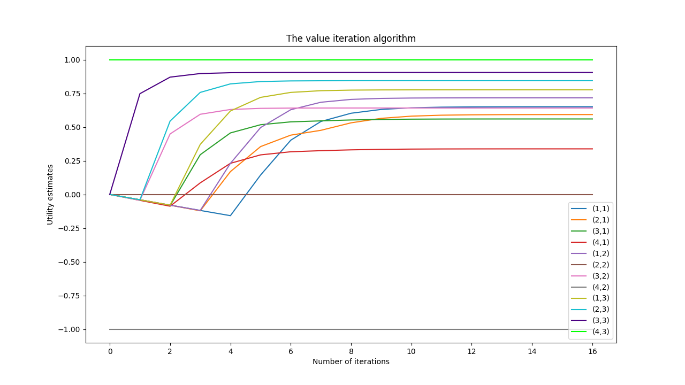
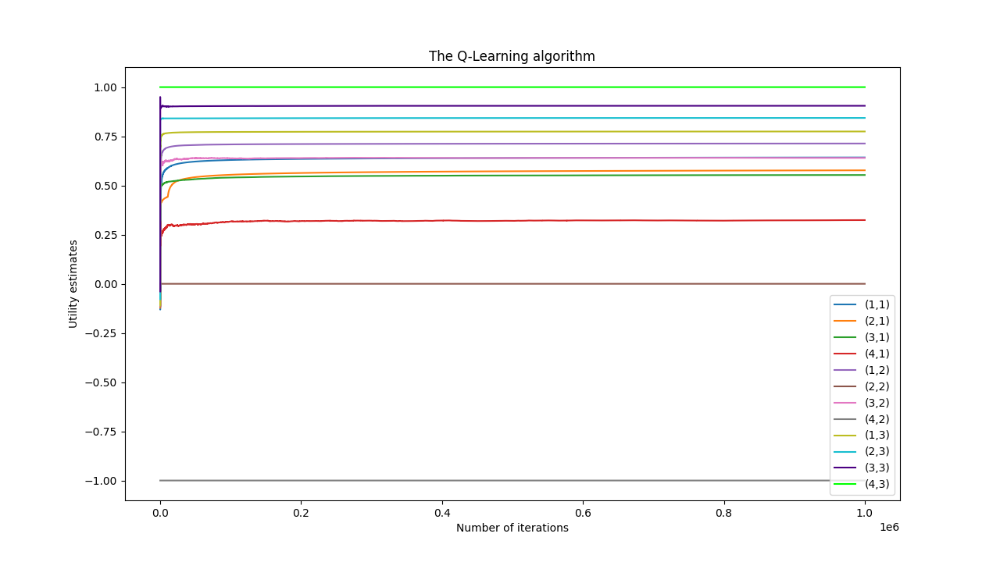

# Markov Decision Problems

Markov Decision Problems is a project I realized in the first semester of my Master's studies within the Artificial Intelligence and Machine Learning course at the Wroclaw University of Technology in the field of Control Engineering and Robotics.
The main goal of this task was to compute solutions to the discrete Markov decision problems (MDP). 
The task consists of two parts.
In the first part the program directly solve the MDP problem of known parameters using the value iteration method. 
In the second part the program solve the MDP of unknown parameters using the Q-learning method.

## Setup
Prerequisites:
* Installed CMake 
* Installed Python3 with numpy and matplotlib

Run `build.sh` script:

    ./build.sh 

Script output:

    -- The C compiler identification is GNU 11.3.0
    -- The CXX compiler identification is GNU 11.3.0
    -- Detecting C compiler ABI info
    -- Detecting C compiler ABI info - done
    -- Check for working C compiler: /usr/bin/cc - skipped
    -- Detecting C compile features
    -- Detecting C compile features - done
    -- Detecting CXX compiler ABI info
    -- Detecting CXX compiler ABI info - done
    -- Check for working CXX compiler: /usr/bin/c++ - skipped
    -- Detecting CXX compile features
    -- Detecting CXX compile features - done
    -- Found Python3: /usr/bin/python3.10 (found version "3.10.6") found components: Interpreter Development NumPy Development.Module Development.Embed
    -- Found PythonLibs: /usr/lib/x86_64-linux-gnu/libpython3.10.so (found suitable version "3.10.6", minimum required is "3.0")
    -- Configuring done
    -- Generating done
    -- Build files have been written to: /home/maciej/Projects/Artificial-Intelligence-and-Machine-Learning/4-Markov-Decision-Problems/build
    [  8%] Building CXX object CMakeFiles/value_iteration.dir/src/mainValueIteration.cpp.o
    [ 16%] Building CXX object CMakeFiles/value_iteration.dir/src/World.cpp.o
    [ 25%] Building CXX object CMakeFiles/value_iteration.dir/src/ValueIterationAlgorithm.cpp.o
    [ 33%] Building CXX object CMakeFiles/value_iteration.dir/src/Plotter.cpp.o
    [ 41%] Building CXX object CMakeFiles/value_iteration.dir/src/CommandLineParser.cpp.o
    [ 50%] Linking CXX executable value_iteration
    [ 50%] Built target value_iteration
    [ 58%] Building CXX object CMakeFiles/qlearning.dir/src/mainQLearning.cpp.o
    [ 66%] Building CXX object CMakeFiles/qlearning.dir/src/World.cpp.o
    [ 75%] Building CXX object CMakeFiles/qlearning.dir/src/Plotter.cpp.o
    [ 83%] Building CXX object CMakeFiles/qlearning.dir/src/QLearning.cpp.o
    [ 91%] Building CXX object CMakeFiles/qlearning.dir/src/CommandLineParser.cpp.o
    [100%] Linking CXX executable qlearning
    [100%] Built target qlearning
    Build completed successfully.

## Usage

Both algorithms validate the input file. When there is no specified starting position in the file, the Value Iteration algorithm sets the default starting position to X=1, Y=1. On the other hand, the Q-Learning algorithm randomly selects the starting position from the available fields in the world, excluding terminal, forbidden, and special states.

### Value Iteration Algorithm

    ./build/value_iteration <data_file> [-g <gamma>] [-p]

- <data_file> (mandatory): The input file containing world data.
- -g <gamma> (optional): Specifies the discount factor (gamma).
- -p (optional): Enables plotting functionality.

    ./build/value_iteration data1.txt -g 0.99 -p

      World Parameters:
      Width X: 4
      Height Y: 3
      Start X: 1
      Start Y: 1
      Uncertainty Distribution P: 0.8(^), 0.1(<), 0.1(>)
      Reward: -0.04
      Discounting Parameter Gamma: 0.99
      Exploration Parameter Epsilon: 0
      (T) Terminal States: (4,2,-1) (4,3,1)
      (B) Special States:
      (F) Forbidden States: (2,2)
    
      +----------+ +----------+ +----------+ +----------+
      |          | |          | |          | | T        |
    3 | >        | | >        | | >        | |          |
      | 0.7762   | | 0.8439   | | 0.9051   | | 1.0000   |
      +----------+ +----------+ +----------+ +----------+
      +----------+ +----------+ +----------+ +----------+
      |          | | F        | |          | | T        |
    2 | ^        | |          | | ^        | |          |
      | 0.7166   | | 0.0000   | | 0.6413   | | -1.0000  |
      +----------+ +----------+ +----------+ +----------+
      +----------+ +----------+ +----------+ +----------+
      | S        | |          | |          | |          |
    1 | ^        | | <        | | ^        | | <        |
      | 0.6506   | | 0.5926   | | 0.5601   | | 0.3380   |
      +----------+ +----------+ +----------+ +----------+
            1            2            3            4

### Q-Learning Algorithm

    ./build/qlearning <data_file> [-g <gamma>] [-e <epsilon>] [-i <iteration>] [-p]

- <data_file> (mandatory): The input file containing world data.
- -g <gamma> (optional): Specifies the discount factor (gamma).
- -e <epsilon> (optional): Specifies the exploration parameter (epsilon).
- -i <iteration> (optional): Specifies the number of iterations of algorithm (default is 10 000).
- -p (optional): Enables plotting functionality.

   
    ./build/qlearning data1.txt -g 0.99 -e 0.5 -i 1000000 -p
    
      World Parameters:
      Width X: 4
      Height Y: 3
      Start X: 1
      Start Y: 1
      Uncertainty Distribution P: 0.8(^), 0.1(<), 0.1(>)
      Reward: -0.04
      Discounting Parameter Gamma: 0.99
      Exploration Parameter Epsilon: 0.5
      (T) Terminal States: (4,2,-1) (4,3,1)
      (B) Special States:
      (F) Forbidden States: (2,2)
    
      QLearning: [==================================================] 100%

      +----------+ +----------+ +----------+ +----------+
      |          | |          | |          | | T        |
    3 | >        | | >        | | >        | |          |
      | 0.7752   | | 0.8434   | | 0.9048   | | 1.0000   |
      +----------+ +----------+ +----------+ +----------+
      +----------+ +----------+ +----------+ +----------+
      |          | | F        | |          | | T        |
    2 | ^        | |          | | ^        | |          |
      | 0.7151   | | 0.0000   | | 0.6395   | | -1.0000  |
      +----------+ +----------+ +----------+ +----------+
      +----------+ +----------+ +----------+ +----------+
      | S        | |          | |          | |          |
    1 | ^        | | <        | | ^        | | <        |
      | 0.6459   | | 0.5822   | | 0.5545   | | 0.3293   |
      +----------+ +----------+ +----------+ +----------+
            1            2            3            4

## Acknowledgements

- [Markov decision process: value iteration with code implementation](https://medium.com/@ngao7/markov-decision-process-value-iteration-2d161d50a6ff)
- [Reinforcement learning: Q-learner with detailed example and code implementation](https://medium.com/@ngao7/reinforcement-learning-q-learner-with-detailed-example-and-code-implementation-f7578976473c)
- [matplotlib-cpp](https://github.com/lava/matplotlib-cpp)